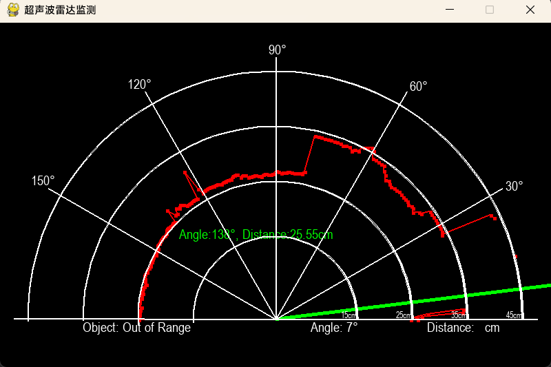

# 版本日志
> 0.1beta 23.01.25
1. 确认阶段目标，给出示意图
   
2. 确定借鉴的主要项目
3. 第一阶段代码开发任务细分
   
> 0.2 beta 23.01.26
1. 理清原代码，暂时删除原代码多余ui线条，便于开发
2. 初设部分参数
3. 实现在图上画出轮廓交点，并用线连接起来
4. 初步建立settings.py文件系统
   
> 0.3 beta 23.01.27
1. 加入is_new_object判据，实现区分不同物体，使不同物体的轮廓点不相连
2. 处理点集内数据，使数据放置合理化
3. 捉虫
> 1.0 23.01.28
1. 增加轮廓点绘制
2. 排除多项方案
3. 启动开发计划日志
4. 实现轮廓点参数可视化 
5. 捉虫
   